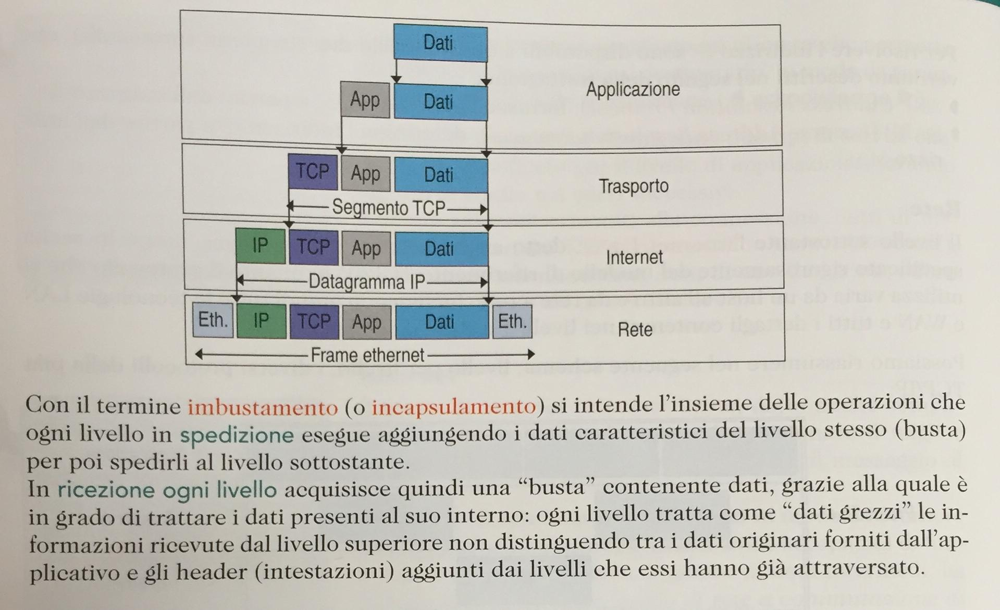

# Ripasso - Il mio host

* Pubblicato su: https://github.com/feroda/lessons-itis/ -> branch 5bi
* Riferimento diretto: https://github.com/feroda/lessons-itis/blob/5bi/doc/ripasso-il-mio-host.md

Questo ripasso fa riferimento alla
[sezione "Il mio host" nel programma](https://github.com/feroda/lessons-itis/blob/5bi/doc/programma.md)

## Setup di un host in una rete LAN

Prima di tutto sapere qual è la rete. Sapere:
* l'indirizzo IP di rete (o un altro indirizzo IP della rete)
* maschera di rete

Esempio:

- Un indirizzo IP della LAN: 34.4.5.254
- Netmask: 255.255.0.0

ne consegue:

- Indirizzo IP della rete: 34.4.0.0

per mettere un host su questa rete posso prendere un indirizzo IP a scelta tra:

34.4.0.1 e 34.4.255.254
poiché la rete va da 34.4.0.0 a 34.4.255.255

Visto che il 34.4.5.254 è già occupato non scelgo quello.
Se ho problemi con il mio nuovo IP provo con un altro indirizzo IP perche' potrebbe averlo preso qualcun altro.

EVITO: oltre ad IP che già conosco su questa rete,
- L'indirizzo di BROADCAST: 34.4.255.255
- L'indirizzo ip di rete: 34.4.0.0

TEST DI CONNESSIONE LAN: ping di un indirizzo IP sulla stessa rete.

* Domanda: come posso vedere cosa accade sulla rete?
* Risposta: con wireshark filtrando i pacchetti ICMP

* Quali livelli del TCP/IP sto verificando la raggiungibilità LAN funziona?
* Questi 2 ip appartengono alla stessa rete?

* PLUS: Quali sarebbero i limiti della rete se la subnet mask fosse 255.255.128.0 ?

## Uscire dalla rete con il default gateway

Ora che ho connesso il mio host nella rete voglio che raggiunga altre reti e in particolare Internet.

Per fare questo imposto il parametro **default gateway**.

Il default gateway identifica la macchina a cui il mio host invia i pacchetti se non sa a chi inviarli (se su reti che non conosce = se su reti non presenti nella sua tabella di routing)

Il test che il gateway funziona lo faccio con `ping` ad un indirizzo esterno (ad es: 89.97.132.192)

L'host identificato da me come gateway non è altro che un router.
Un router per definizione è collegato a più di una rete e il suo ruolo è quello di instradare i pacchetti tra le reti cui è connesso.

#### Domande

- quale livello dello stack TCP/IP sto testando?
- se mi funziona la connessione in LAN, ma non funziona il ping all'indirizzo IP scelto, quali altri test posso fare per chiarire meglio la situazione? Fino a che punto posso attribuirmi la colpa, oppure rinunciare al
fatto che la connessione funzioni se non sento l'amministratore di rete?

## Ruolo del DNS

Il servizio DNS funziona in modo analogo ad una rubrica telefonica.

I servizi DNS pubblici sono come la rubrica degli indirizzi IP di Internet, come le pagine bianche però mondiali.

Il servizio DNS viene contattato ogni volta che un programma vuole raggiungere un altro host tramite il nome host, e non direttamente tramite l'indirizzo IP.

TEST:
* si può fare con `ping`. Ad esempio: `ping www.google.it`
* strumento specifico per testare il servizio dns è `dig` (ad es: `dig www.google.it` o `dig +short www.google.it`)

Come verifico se ho interrogato il DNS?
Con un analizzatore di traffico di rete... quale sarà mai?

## definizione di una subnet e appartenenza di un IP ad una subnet

già verificato nel punto 1 del ripasso.

Se metto in AND bit a bit 2 indirizzi IP con le rispettive subnet mask e ottengo lo stesso indirizzo IP => i 2 IP sono sulla stessa rete.

## incapsulamento dei pacchetti sulla rete - caratteristiche di ogni livello del TCP/IP

Con wireshark se seleziono un pacchetto a caso, vedo in fondo i byte che lo compongono.

Se clicco nella parte centrale del programma si evidenziano nella parte sottostante i byte coinvolti.

Quindi posso cliccare su ogni livello dello stack TCP/IP e verificare come avviene l'incapsulamento (o imbustamento) di un pacchetto.

Attenzione che wireshark aggiunge uno "pseudo-livello" chiamato "Frame". Questa astrazione è fatta solamente per dare informazioni sul pacchetto acquisito (ad esempio: quando wireshark ha acquisito quel pacchetto)

Per il supporto di teoria vedere lo schema: 

* Utente -> usa il software X che gli serve per ottenere una funzionalità.
* X parla ad un livello APPLICAZIONE
* Il SO con lo stack TCP/IP aggiunge:
  * una intestazione di TRASPORTO (intestazione TCP o UDP)
  * una intestazione di RETE (intestazione IP)
  * una intestazione di livello DATALINK (intestazione Ethernet) e si costituisce cosi il FRAME ETHERNET

Il messaggio viaggia sulla rete

* Il SO sull'altro host riceve il messaggio e toglie:
  * l'intestazione Ethernet
  * l'intestazione IP
  * l'intestazione TCP (o UDP)
* Il SO manda il contenuto di livello APPLICAZIONE al software Y (remoto) che:
  * interpreta il MESSAGGIO
  * elabora la risposta
  * risponde

La risposta verrà presa in carico dal SO e attraverserà lo stack TCP/IP

## Strumenti

- su GNU/Linux usare il man

